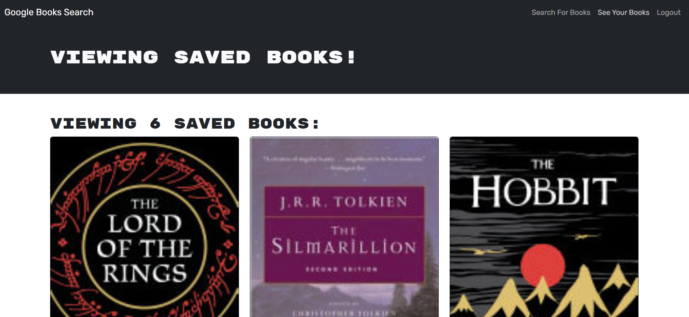

# Book Search Engine

## Description
Fully functioning Google Books API search engine built with a RESTful API, refactored to be a GraphQL API built with Apollo Server.  

## Table of Contents

- [Installation](#installation)
- [Usage](#usage)
- [Credits](#credits)
- [License](#license)
- [Questions](#questions)

## Installation

[Book Search Engine Deployed Application](https://book-search-engine-zdpy.onrender.com/)

## Usage

* Sign up by providing a user name, your email address, and a password or login if you've already signed up
* Enter a book name into the search field and click on 'Submit Search' to see a list of books
* Click on 'Save this Book!' to add it to your book list
* Select 'See Your Books' to see your saved book list

## Credits

* Node.js & Eslint Copyright [OpenJS Foundation](https://openjsf.org/) and Node.js contributors. All rights reserved. 
* Apollo Server Copyright © 2016-2020 Apollo Graph, Inc. (Formerly Meteor Development Group, Inc.)
* Bcrypt Copyright © 2010 Nicholas Campbell
* Express Copyright © 2009-2014 TJ Holowaychuk <tj@vision-media.ca>,
Copyright © 2013-2014 Roman Shtylman <shtylman+expressjs@gmail.com>,
Copyright © 2014-2015 Douglas Christopher Wilson <doug@somethingdoug.com>
* Jsonwebtoken Copyright © 2015 Auth0, Inc. <support@auth0.com> (http://auth0.com)
* Mongoose Copyright © 2010-2013 LearnBoost dev@learnboost.com Copyright (c) 2013-2021 Automattic
* Graphql Copyright © GraphQL Contributors
* Apollo Client Copyright © 2022 Apollo Graph, Inc. (Formerly Meteor Development Group, Inc.)
* Bootstrap Copyright © 2011-2024 The Bootstrap Authors
* JWT Decode Copyright © 2015 Auth0, Inc. <support@auth0.com> (http://auth0.com)
* React & React-dom Copyright © Meta Platforms, Inc. and affiliates.
* React-router-dom Copyright © React Training LLC 2015-2019 Copyright © Remix Software Inc. 2020-2021 Copyright © Shopify Inc. 2022-2023
* React-bootstrap Copyright © 2014-present Stephen J. Collings, Matthew Honnibal, Pieter Vanderwerff
* Eslint-plugin-react Copyright © 2014 Yannick Croissant
* Eslint-plugin-react-refresh Copyright © [Arnaud Barré](https://github.com/ArnaudBarre)
* Vite Copyright © 2019-present, Yuxi (Evan) You and Vite contributors

## License

This application is covered under the MIT License.

## Questions

[GitHub Profile](https://github.com/kevinchogan)

For questions, please contact kchogan@pacbell.net.
